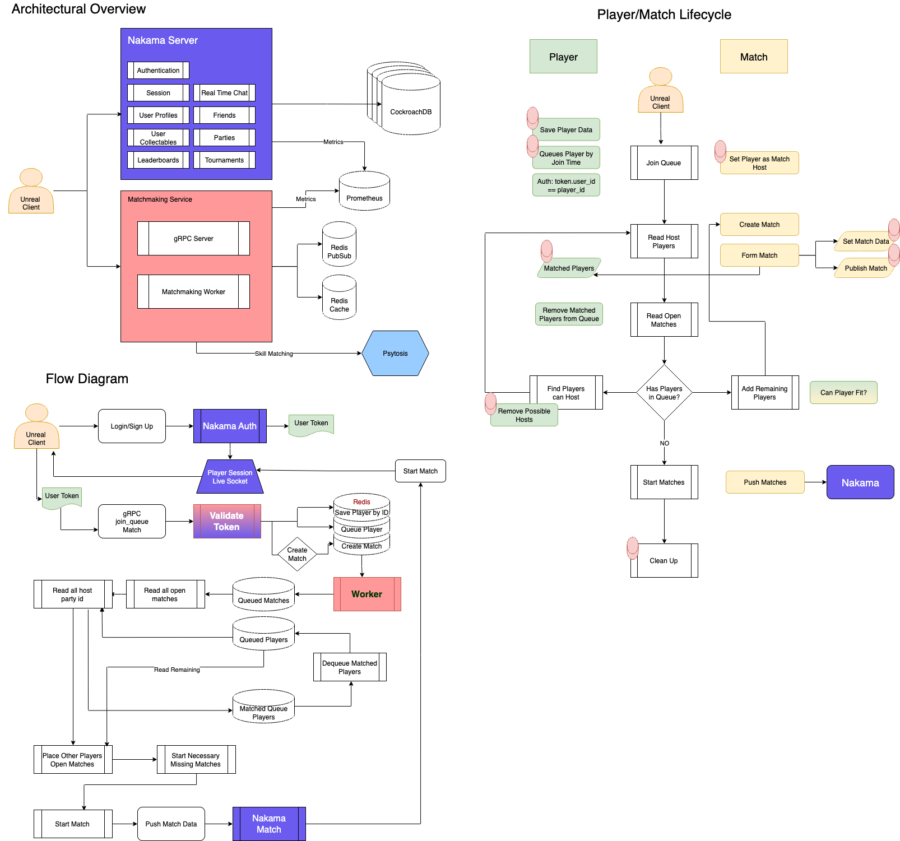

# MHTH

## Requirements

- [Rust](https://rustup.rs/)
- [gRPC](https://grpc.io/)
    - Download compiler https://github.com/protocolbuffers/protobuf/releases (protoc-xx.x-win64.zip for windows)
    - Unzip it in your preferred folder, eg: `C:\protoc`.
    - Add protoc binary to your `PATH`, Press `Win + S` and type "Environment Variables" to open the System Properties window.
    - Go to your **User Variables** and select `PATH` and click **Edit**.
    - Click on **new** and add the the `bin/` folder to your path (`C:\protoc\bin`).
    - On  powershell write `protoc --version` to verify its correct.
- `Just`: `cargo install just`
    - on [Windows Check](https://github.com/casey/just?tab=readme-ov-file#windows) 
    - [VS Code Ext](https://marketplace.visualstudio.com/items?itemName=nefrob.vscode-just-syntax)
    - [Cheatsheet](https://cheatography.com/linux-china/cheat-sheets/justfile/)
- Golang: [installer](https://go.dev/doc/install)
- Docker: [Get Docker](https://docs.docker.com/get-started/get-docker/)

## Usage

### Development
- In `nakama/` folder execute `go mod vendor`.
- In `root/` folder execute `cargo build -r`.

### Execution
- Add or edit the `.env` file in `crates/matchmaking/`.
    ```ini
    LOG_LEVEL=DEBUG
    NAKAMA_HOST=nakama_mms
    NAKAMA_GRPC_PORT=7349
    NAKAMA_REST_PORT=7350
    NAKAMA_CONSOLE_PORT=7351
    NAKAMA_USERNAME=mhth_nakama_admin
    NAKAMA_PASSWORD=<some password>
    NAKAMA_SERVER_KEY_NAME=defaultkey
    NAKAMA_SERVER_KEY=abcde123
    REDIS_URL=redis_mms
    REDIS_PORT=6379
    REDIS_USER=redis_mms_admin
    REDIS_PASSWORD=<some password2>
    ```
- execute `just server-up`

## Architecture Outline

